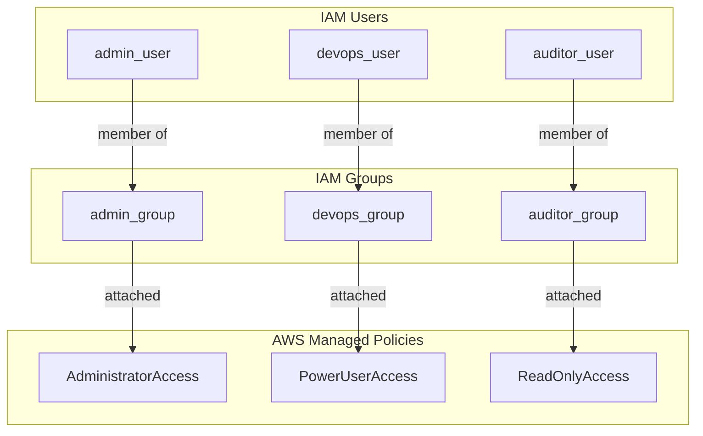

# AWS IAM Terraform

Terraform project that sets up AWS IAM users and groups with role-based access.

## What this does

Users are placed into groups. Each group has one AWS managed policy attached. Users inherit permissions from their group — not from policies assigned directly to them.

There are three roles:

| Group           | User           | Policy              | Access                           |
| --------------- | -------------- | ------------------- | -------------------------------- |
| `admin_group`   | `admin_user`   | AdministratorAccess | Full account access              |
| `devops_group`  | `devops_user`  | PowerUserAccess     | Manage resources, no IAM changes |
| `auditor_group` | `auditor_user` | ReadOnlyAccess      | View only                        |

## Design Architecture

